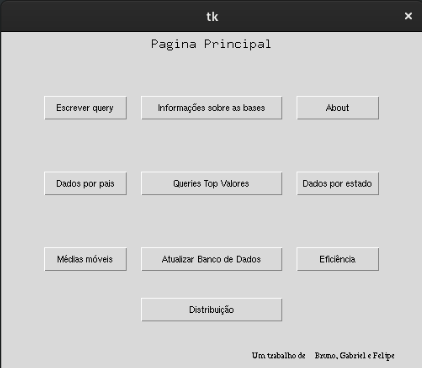
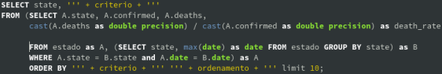
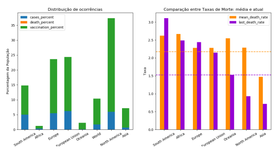
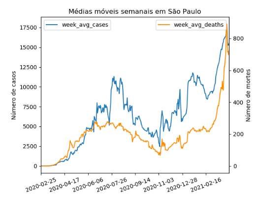

# Monitora COVID

O sistema MonitoraCovid foi desenvolvido com o proprósito de ser uma ferramenta flexível e
automatizada para acompanhar o avanço da pandemia. Para isso, o sistema utiliza bots que capturam automaticamente as bases nacionais e internacionais disponíveis na internet. Posteriormente, são geradas tabelas de acordo com os modelos aqui apresentados. Por fim, são disponibilizadas funções de consulta pré-estabelecidas assim como a disponibilidade de realização de consultas próprias.

A implementação foi realizada utilizando PostgresSQL e Python. Bibliotecas auxiliares tais como: psycopg , tkinter, pandas, dask e matplotlib foram utilizadas para conexão com o banco de dados, criação de interfaces, manipulação de consultas e plotagem.

No mais, é importante ressaltar que foram utilizadas bases já existentes. Assim, as restrições de modelagem são impostas pelas mesmas – isso ficará evidente na transição de modelo ER para Lógico.

## Vídeo explicativo

https://drive.google.com/drive/folders/1ak4GChgrIhhP-W6iLWV7p2C7GhX-8-e-?usp=sharing
